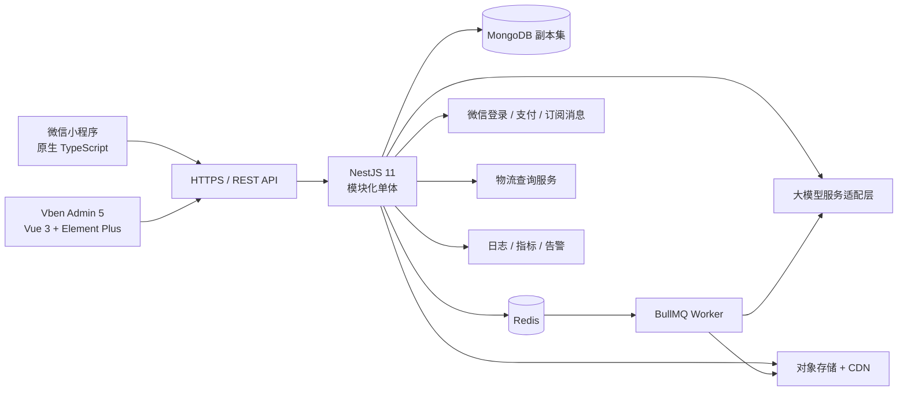
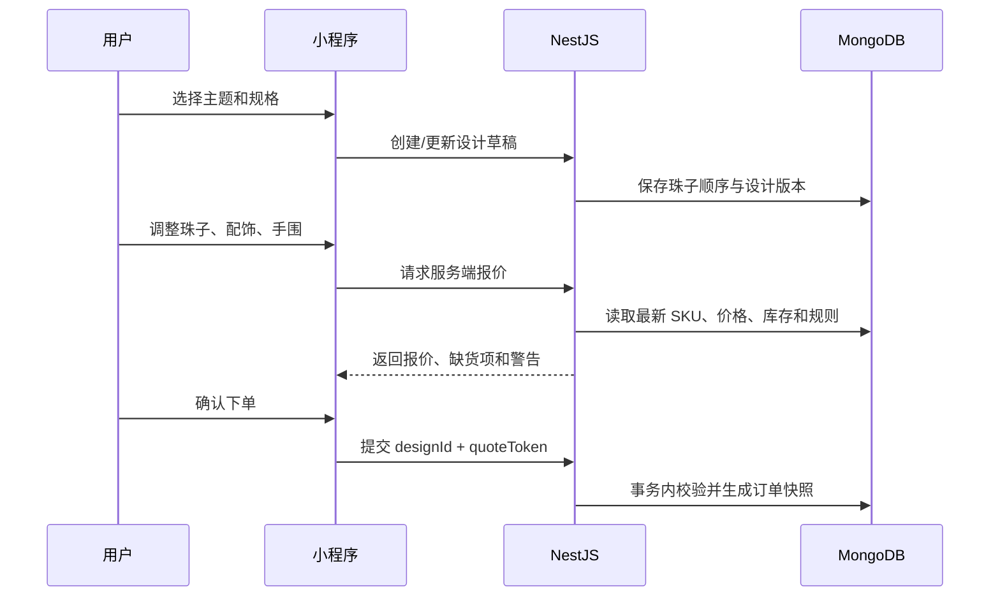

# 一念一串小程序技术开发文档

> 文档版本：v1.0  
> 编制日期：2026-06-12  
> 适用范围：微信小程序、NestJS 后端、Vben Admin Element Plus 管理后台

## 1. 项目目标

“一念一串”是一款围绕水晶手串 DIY、个性主题推荐、成品记录与情感内容生成的小程序。

一期需要形成以下完整业务闭环：

1. 用户通过五行、星座、MBTI、生肖/本命年主题进入选品。
2. 用户在 DIY 创作台选择珠子、配饰、隔片、绳子和吊坠，并实时调整顺序。
3. 服务端重新计算价格、库存和可制作性，生成购物车或订单。
4. 用户完成微信支付、收货、评价和售后。
5. 制作完成的手串进入“手串册”。
6. 系统为手串生成名字、“念”、“宜”和节气信息。
7. 用户可编辑、重写念卡，选择模板并生成 9:16 分享海报。
8. 管理后台维护素材、库存、主题规则、订单、念卡模板、内容和用户。

## 2. 建设范围

### 2.1 一期范围

- 微信登录、手机号绑定、用户资料和地址管理
- 首页运营配置、主题入口和主题问答
- 珠子/配件分类、SKU、库存、价格和搜索
- DIY 手串编辑、草稿保存、复制和历史版本
- 收藏、手串册、念卡生成、编辑和分享海报
- 购物车、订单、微信支付、物流、评价和售后申请
- 珠子百科、客服入口、协议与关于我们
- Vben 管理后台、RBAC、操作日志和基础数据报表
- 对象存储、任务队列、监控、备份和发布流程

### 2.2 暂不纳入一期

- 多商家入驻和结算
- 用户间交易
- 复杂会员等级和分销体系
- 独立 App、H5 商城
- 直播、即时聊天和社区私信
- 基于图像识别的珠子鉴定

## 3. 总体技术架构



### 3.1 架构原则

- 一期采用“模块化单体”，不拆微服务，降低事务、部署和联调成本。
- 小程序 API 与管理端 API 使用相同 NestJS 应用，但分控制器、鉴权策略和路由前缀。
- 商品名称、图片和价格在订单中保存不可变快照，避免后台修改影响历史订单。
- 金额统一使用整数“分”，禁止使用浮点数参与计价。
- 库存、支付、退款等关键写操作必须幂等。
- AI 内容生成通过任务队列执行，不阻塞普通 API 进程。
- MongoDB 生产环境必须部署副本集，订单创建等跨集合写入才可使用事务。
- 文件不存入 MongoDB，只保存对象存储 URL、文件 Key、尺寸、哈希和业务元数据。

## 4. 技术选型

| 位置 | 推荐方案 | 说明 |
| --- | --- | --- |
| 小程序 | 微信原生小程序 + TypeScript + Skyline/Canvas 2D | DIY 拖拽、Canvas 海报和微信能力接入更直接 |
| 状态管理 | MobX Miniprogram 或轻量 Store | 保存用户、设计草稿、购物车和页面会话 |
| 请求层 | TypeScript 封装 `wx.request` | 统一 Token、错误码、重试和 Request ID |
| 后端 | NestJS 11 + TypeScript | REST API、依赖注入、模块化和测试体系 |
| HTTP | Fastify Adapter | 高并发和较低开销；上传接口单独验证兼容性 |
| 数据访问 | `@nestjs/mongoose` + Mongoose | 与 NestJS 集成成熟，适合文档型设计数据 |
| 数据库 | MongoDB 8.x 副本集 | 主业务数据、设计快照、订单和内容 |
| 缓存/队列 | Redis + BullMQ | 缓存、限流、分布式锁、任务和幂等 |
| 管理后台 | Vben Admin 5 Element Plus 版本 | Vue 3、Vite、TypeScript、动态菜单与按钮权限 |
| 表格/表单 | Vben Form + Vben Vxe Table + Element Plus | 搜索列表、编辑抽屉和复杂业务表单 |
| API 文档 | Swagger / OpenAPI | 生成接口文档和前端类型 |
| 文件服务 | 腾讯云 COS 或兼容 S3 的对象存储 | 商品图、头像、念卡、分享海报 |
| 日志监控 | Pino + OpenTelemetry + Sentry/云监控 | 结构化日志、链路、异常和告警 |
| 测试 | Jest + Supertest + Playwright | 单元、接口和管理后台 E2E |
| 包管理 | pnpm | 后端和 Vben Admin 统一版本管理 |

> Vben Admin 5 当前工程要求以官方仓库为准。2026-06 官方快速开始文档要求 Node.js 22.18.0 或以上，并只支持 pnpm。

## 5. 推荐仓库结构

当前项目已有 `backend`、`fronted`、`miniprogram` 三个独立 Git 仓库。建议将拼写不准确的 `fronted` 在正式开发前调整为 `admin`，避免长期进入部署脚本和域名配置。

```text
crystal-diy/
├── backend/                 # NestJS API 与 Worker
├── admin/                   # Vben Admin Element Plus
├── miniprogram/             # 微信小程序
├── docs/                    # 产品、技术、接口和上线文档
└── deploy/                  # Docker Compose、Nginx、CI/CD 模板
```

后端内部建议：

```text
backend/src/
├── main.ts
├── app.module.ts
├── common/
│   ├── constants/
│   ├── decorators/
│   ├── dto/
│   ├── filters/
│   ├── guards/
│   ├── interceptors/
│   ├── pipes/
│   └── utils/
├── config/
├── infrastructure/
│   ├── database/
│   ├── redis/
│   ├── queue/
│   ├── storage/
│   ├── wechat/
│   ├── ai/
│   └── logistics/
├── modules/
│   ├── auth/
│   ├── users/
│   ├── catalog/
│   ├── themes/
│   ├── designs/
│   ├── bracelets/
│   ├── thought-cards/
│   ├── favorites/
│   ├── carts/
│   ├── orders/
│   ├── payments/
│   ├── after-sales/
│   ├── content/
│   ├── reviews/
│   ├── notifications/
│   ├── admin-auth/
│   ├── rbac/
│   ├── audit/
│   └── dashboard/
└── workers/
    ├── thought-card.processor.ts
    ├── poster.processor.ts
    └── notification.processor.ts
```

## 6. 业务域划分

| 业务域 | 主要职责 |
| --- | --- |
| 身份与用户 | 微信登录、Token、手机号、资料、画像、地址 |
| 主题推荐 | 五行、星座、MBTI、生肖配置，问答和推荐规则 |
| 商品目录 | 分类、材质、珠子、配饰、SKU、价格、库存 |
| DIY 设计 | 设计草稿、珠子位置、手围、绳型、版本和报价 |
| 手串册 | 已完成手串、来源订单、作品图、公开状态 |
| 念卡 | AI 生成、人工编辑、模板、重写、海报和审核 |
| 交易 | 购物车、订单、优惠、支付、退款、物流 |
| 用户资产 | 收藏、积分、评价、订阅消息授权 |
| 内容 | 首页配置、珠子百科、协议、关于我们 |
| 平台管理 | 管理员、角色、权限、字典、日志、报表 |

## 7. 核心业务流程

### 7.1 登录

1. 小程序调用 `wx.login()` 获取临时 `code`。
2. 后端调用微信 `code2Session`，获得 `openid` 和 `session_key`。
3. 后端按 `openid + appid` 查找或创建用户。
4. 后端返回短期 Access Token 与可轮换的 Refresh Token。
5. Refresh Token 仅保存哈希；用户退出、封禁或改密时可吊销。

建议：

- Access Token 有效期 2 小时。
- Refresh Token 有效期 30 天，轮换使用。
- 不把微信 `session_key` 返回给客户端。
- 管理后台使用独立管理员账号体系，不与小程序用户复用。

### 7.2 DIY 与报价



DIY 设计中的每个组件至少包含：

```ts
interface DesignItem {
  instanceId: string;       // 同一 SKU 多次使用时的唯一实例 ID
  skuId: string;
  productId: string;
  category: 'main_bead' | 'bead' | 'accessory' | 'spacer' | 'cord' | 'pendant';
  position: number;
  quantity: number;
  diameterMm?: number;
  rotation?: number;
}
```

关键约束：

- 客户端价格仅用于实时展示，最终价格必须由服务端重新计算。
- `quoteToken` 包含设计版本和报价过期时间，建议 10 分钟失效。
- 下单时保存商品、SKU、图片、规格、数量、单价和设计图快照。
- 设计更新使用 `version` 做乐观锁，防止多端覆盖。

### 7.3 念卡生成

1. 用户从手串册点击“生成念卡”。
2. 服务端创建 `thought_card_generation` 任务并立即返回任务 ID。
3. Worker 聚合主题画像、珠子寓意、节气和用户选择。
4. AI 返回结构化 JSON：`name`、`thought`、`suitable`、`solarTerm`。
5. 服务端校验长度、敏感词、JSON Schema 和内容安全。
6. 结果写入念卡并通知客户端轮询结果。
7. 小程序先展示 3 秒仪式动画；若任务未完成则继续展示生成状态。

生成接口不要承诺 AI 一定在 3 秒内完成。验收中的“3 秒生成动画”是前端体验约束，后端目标建议：

- P50 小于 2.5 秒
- P95 小于 8 秒
- 超时 15 秒进入失败或降级文案

必须设计降级方案：

- AI 服务异常时使用规则模板生成基础念卡。
- 相同手串和生成参数可短期复用结果，避免重复计费。
- 每位用户设置日生成次数和重写次数。
- 保存模型、Prompt 版本、耗时、Token 用量和审核结果，便于追踪。

### 7.4 下单与支付

订单状态：

```text
PENDING_PAYMENT
  ├─支付成功→ PAID → PROCESSING → SHIPPED → RECEIVED → COMPLETED
  ├─用户取消→ CANCELLED
  └─超时关闭→ CLOSED

PAID / PROCESSING / SHIPPED
  └─申请售后→ AFTER_SALE_PENDING → REFUNDING → REFUNDED
```

交易规则：

- 创建订单时生成业务订单号，使用时间前缀 + 随机序列，不暴露 MongoDB `_id`。
- 支付回调先验签、再按微信支付单号和订单号执行幂等更新。
- 支付成功以服务端回调为准，客户端查询结果只用于刷新界面。
- 库存一期建议采用“下单预占，超时释放”。
- 订单创建、库存预占、优惠核销使用 MongoDB 事务。
- 支付和退款回调原文加密归档，敏感字段脱敏。

## 8. MongoDB 数据模型

### 8.1 集合清单

| 集合 | 用途 | 关键索引 |
| --- | --- | --- |
| `users` | 小程序用户 | `openid + appid` 唯一、`mobile` 稀疏唯一 |
| `user_profiles` | 五行/星座/MBTI/生肖画像 | `userId` 唯一 |
| `user_addresses` | 地址 | `userId + isDefault` |
| `admin_users` | 管理员 | `username` 唯一、`mobile` 稀疏唯一 |
| `roles` | 角色 | `code` 唯一 |
| `permissions` | 菜单/按钮/API 权限 | `code` 唯一 |
| `categories` | 大类和小类树 | `parentId + sort`、`code` 唯一 |
| `products` | 商品/SPU | `categoryId + status`、文本检索字段 |
| `skus` | 规格、价格和库存 | `skuCode` 唯一、`productId + status` |
| `inventory_logs` | 库存流水 | `skuId + createdAt`、`bizType + bizId` |
| `theme_configs` | 五行等主题和选项 | `type + code` 唯一 |
| `recommendation_rules` | 推荐规则 | `themeType + status + priority` |
| `designs` | DIY 设计草稿 | `userId + updatedAt`、`status` |
| `design_versions` | 设计版本快照 | `designId + version` 唯一 |
| `bracelets` | 手串册成品 | `userId + createdAt`、`orderId` |
| `thought_cards` | 念卡内容 | `braceletId + createdAt`、`userId + status` |
| `thought_card_templates` | 六类卡片模板 | `code` 唯一、`status + sort` |
| `generation_tasks` | AI/海报任务 | `userId + createdAt`、TTL 索引 |
| `favorites` | 收藏 | `userId + targetType + targetId` 唯一 |
| `carts` | 用户购物车 | `userId` 唯一 |
| `orders` | 订单 | `orderNo` 唯一、`userId + status + createdAt` |
| `payments` | 支付记录 | `paymentNo`、`transactionId` 唯一 |
| `refunds` | 退款记录 | `refundNo` 唯一、`orderId + status` |
| `after_sales` | 售后单 | `afterSaleNo` 唯一、`orderId + status` |
| `reviews` | 评价 | `orderItemId` 唯一、`productId + status` |
| `articles` | 珠子百科和协议 | `type + status + publishedAt` |
| `home_blocks` | 首页运营区块 | `page + status + sort` |
| `notifications` | 站内通知/订阅消息记录 | `userId + readAt + createdAt` |
| `audit_logs` | 后台操作日志 | `operatorId + createdAt`、TTL 可选 |
| `idempotency_keys` | 幂等请求 | `key + scope` 唯一、TTL 索引 |

### 8.2 用户模型

```ts
interface User {
  _id: ObjectId;
  appid: string;
  openid: string;
  unionid?: string;
  nickname: string;
  avatarUrl?: string;
  mobileEncrypted?: string;
  status: 'active' | 'disabled' | 'deleted';
  source?: string;
  lastLoginAt?: Date;
  createdAt: Date;
  updatedAt: Date;
}
```

隐私要求：

- 手机号、收货人姓名、完整地址使用应用层信封加密。
- 管理后台默认只返回掩码值。
- 解密查看需要单独权限并记录审计日志。
- “删除用户”先执行业务匿名化，订单依法保留但移除可识别信息。

### 8.3 商品和 SKU

`products` 保存稳定商品信息，`skus` 保存可售规格。

```ts
interface Sku {
  _id: ObjectId;
  skuCode: string;
  productId: ObjectId;
  attributes: Record<string, string | number>;
  salePrice: number;       // 分
  costPrice?: number;      // 分，仅后台
  availableStock: number;
  lockedStock: number;
  safetyStock: number;
  weightGram?: number;
  status: 'enabled' | 'disabled' | 'sold_out';
  version: number;
}
```

库存更新条件必须带版本或可用库存判断，例如：

```js
{
  _id: skuId,
  availableStock: { $gte: quantity },
  version
}
```

### 8.4 设计模型

```ts
interface Design {
  _id: ObjectId;
  designNo: string;
  userId: ObjectId;
  name?: string;
  sourceTheme?: {
    type: 'wuxing' | 'zodiac' | 'mbti' | 'chinese_zodiac' | 'free';
    optionCodes: string[];
    preferenceCode?: string;
  };
  wristSizeMm: number;
  items: DesignItem[];
  previewImage?: FileRef;
  pricing: {
    materialAmount: number;
    craftAmount: number;
    discountAmount: number;
    totalAmount: number;
    pricedAt: Date;
  };
  version: number;
  status: 'draft' | 'quoted' | 'ordered' | 'archived';
  createdAt: Date;
  updatedAt: Date;
}
```

`design_versions` 只保存关键节点或手动保存的快照，不必记录每一次拖动。

### 8.5 订单模型

```ts
interface Order {
  _id: ObjectId;
  orderNo: string;
  userId: ObjectId;
  status: OrderStatus;
  items: Array<{
    orderItemId: string;
    designId?: ObjectId;
    productId: ObjectId;
    skuId: ObjectId;
    snapshot: {
      name: string;
      image: string;
      skuCode: string;
      attributes: Record<string, string | number>;
    };
    quantity: number;
    unitPrice: number;
    totalPrice: number;
  }>;
  designSnapshot?: Record<string, unknown>;
  receiverSnapshot: EncryptedAddress;
  amount: {
    goods: number;
    shipping: number;
    discount: number;
    payable: number;
    paid: number;
    refunded: number;
  };
  paymentExpireAt?: Date;
  paidAt?: Date;
  shippedAt?: Date;
  completedAt?: Date;
  cancelReason?: string;
  version: number;
  createdAt: Date;
  updatedAt: Date;
}
```

### 8.6 念卡模型

```ts
interface ThoughtCard {
  _id: ObjectId;
  cardNo: string;
  userId: ObjectId;
  braceletId: ObjectId;
  generationSource: 'ai' | 'rule' | 'manual';
  content: {
    name: string;
    thought: string;
    suitable: string[];
    solarTerm: string;
  };
  templateCode: 'paper' | 'petal' | 'minimal' | 'solar_term' | 'voice' | 'red_packet';
  sourceSnapshot: {
    theme?: Record<string, unknown>;
    materials: Array<{ name: string; meaning?: string }>;
  };
  aiMeta?: {
    provider: string;
    model: string;
    promptVersion: string;
    latencyMs: number;
    inputTokens?: number;
    outputTokens?: number;
  };
  moderation: {
    status: 'pending' | 'passed' | 'rejected' | 'manual_review';
    labels?: string[];
  };
  poster?: FileRef;
  version: number;
  status: 'draft' | 'published' | 'disabled';
  createdAt: Date;
  updatedAt: Date;
}
```

## 9. API 设计

### 9.1 约定

- 基础路径：`/api/v1`
- 小程序端：`/api/v1/app/*`
- 管理后台：`/api/v1/admin/*`
- 微信回调：`/api/v1/callbacks/wechat/*`
- 健康检查：`/health/live`、`/health/ready`
- Content-Type：`application/json`
- 时间：ISO 8601 UTC，展示层转换为 Asia/Shanghai
- 分页：`page`、`pageSize`，后台最大 200
- 请求追踪：客户端传或服务端生成 `X-Request-Id`
- 写接口支持 `Idempotency-Key`

统一成功响应：

```json
{
  "code": 0,
  "message": "ok",
  "data": {},
  "requestId": "req_xxx",
  "timestamp": "2026-06-12T08:00:00.000Z"
}
```

统一错误响应：

```json
{
  "code": 40012001,
  "message": "部分材料库存不足",
  "details": [{ "skuId": "xxx", "available": 2 }],
  "requestId": "req_xxx",
  "timestamp": "2026-06-12T08:00:00.000Z"
}
```

错误码建议分段：

| 范围 | 模块 |
| --- | --- |
| `40010xxx` | 认证与权限 |
| `40011xxx` | 用户 |
| `40012xxx` | 商品与库存 |
| `40013xxx` | DIY 设计 |
| `40014xxx` | 订单 |
| `40015xxx` | 支付退款 |
| `40016xxx` | 念卡和生成任务 |
| `40017xxx` | 内容和文件 |

### 9.2 小程序核心接口

#### 认证与用户

| 方法 | 路径 | 说明 |
| --- | --- | --- |
| POST | `/app/auth/wechat-login` | 微信 code 登录 |
| POST | `/app/auth/refresh` | 刷新 Token |
| POST | `/app/auth/logout` | 注销当前会话 |
| GET | `/app/me` | 当前用户 |
| PATCH | `/app/me` | 修改头像、昵称 |
| PUT | `/app/me/profile` | 保存五行/星座/MBTI/生肖画像 |
| GET/POST | `/app/addresses` | 地址列表/新增 |
| PATCH/DELETE | `/app/addresses/:id` | 修改/删除地址 |

#### 首页、主题和商品

| 方法 | 路径 | 说明 |
| --- | --- | --- |
| GET | `/app/home` | 首页区块聚合数据 |
| GET | `/app/themes` | 主题入口 |
| GET | `/app/themes/:type` | 主题问题和选项 |
| POST | `/app/recommendations` | 根据主题答案推荐素材 |
| GET | `/app/categories` | DIY 分类树 |
| GET | `/app/products` | 商品列表 |
| GET | `/app/products/:id` | 商品详情和 SKU |
| GET | `/app/articles` | 珠子百科 |
| GET | `/app/articles/:slug` | 百科详情 |

#### DIY、收藏与手串册

| 方法 | 路径 | 说明 |
| --- | --- | --- |
| POST | `/app/designs` | 创建设计 |
| GET | `/app/designs/:id` | 读取设计 |
| PATCH | `/app/designs/:id` | 更新设计，携带 version |
| POST | `/app/designs/:id/quote` | 服务端报价 |
| POST | `/app/designs/:id/duplicate` | 复制设计 |
| POST | `/app/designs/:id/preview` | 上传/生成预览图 |
| GET | `/app/bracelets` | 手串册 |
| GET | `/app/bracelets/:id` | 手串详情 |
| GET/POST/DELETE | `/app/favorites` | 收藏管理 |

#### 念卡

| 方法 | 路径 | 说明 |
| --- | --- | --- |
| POST | `/app/bracelets/:id/thought-cards/generate` | 创建生成任务 |
| GET | `/app/generation-tasks/:id` | 查询任务状态 |
| GET | `/app/thought-cards/:id` | 念卡详情 |
| PATCH | `/app/thought-cards/:id` | 编辑文字或模板 |
| POST | `/app/thought-cards/:id/rewrite` | 重写 |
| POST | `/app/thought-cards/:id/poster` | 创建海报任务 |
| GET | `/app/thought-card-templates` | 六种模板 |

生成任务响应：

```json
{
  "code": 0,
  "data": {
    "taskId": "task_xxx",
    "status": "queued",
    "pollAfterMs": 800
  }
}
```

#### 订单、支付和售后

| 方法 | 路径 | 说明 |
| --- | --- | --- |
| POST | `/app/orders/preview` | 订单预览 |
| POST | `/app/orders` | 创建订单 |
| GET | `/app/orders` | 按状态查询订单 |
| GET | `/app/orders/:id` | 订单详情 |
| POST | `/app/orders/:id/cancel` | 取消未支付订单 |
| POST | `/app/orders/:id/pay` | 获取微信支付参数 |
| POST | `/callbacks/wechat/pay` | 微信支付回调 |
| POST | `/callbacks/wechat/refund` | 微信退款回调 |
| POST | `/app/orders/:id/confirm-receipt` | 确认收货 |
| POST | `/app/orders/:id/reviews` | 评价 |
| POST | `/app/after-sales` | 创建售后申请 |
| GET | `/app/after-sales` | 售后列表 |

### 9.3 管理后台接口

后台列表接口统一支持分页、排序、精确过滤和日期范围，不允许把任意 MongoDB 查询表达式直接透传给客户端。

主要接口域：

- `/admin/auth`
- `/admin/dashboard`
- `/admin/users`
- `/admin/products`
- `/admin/skus`
- `/admin/inventory`
- `/admin/categories`
- `/admin/themes`
- `/admin/recommendation-rules`
- `/admin/designs`
- `/admin/bracelets`
- `/admin/thought-cards`
- `/admin/thought-card-templates`
- `/admin/orders`
- `/admin/payments`
- `/admin/refunds`
- `/admin/after-sales`
- `/admin/reviews`
- `/admin/articles`
- `/admin/home-blocks`
- `/admin/admin-users`
- `/admin/roles`
- `/admin/permissions`
- `/admin/audit-logs`
- `/admin/system-configs`

### 9.4 OpenAPI 契约

- DTO 使用 `class-validator` 和 `class-transformer`。
- 全局启用 `ValidationPipe({ whitelist: true, forbidNonWhitelisted: true, transform: true })`。
- 使用 `@nestjs/swagger` 生成 OpenAPI JSON。
- CI 中根据 OpenAPI 生成小程序和后台的 TypeScript API 类型。
- API 发生破坏性变更时发布 `/v2`，不在同一 DTO 中堆积大量兼容字段。

## 10. NestJS 模块设计

每个业务模块建议保持以下结构：

```text
orders/
├── controllers/
│   ├── app-orders.controller.ts
│   └── admin-orders.controller.ts
├── dto/
├── schemas/
├── repositories/
├── services/
├── events/
├── policies/
├── orders.module.ts
└── orders.service.spec.ts
```

职责约束：

- Controller：协议转换、鉴权、DTO，不写业务流程。
- Service：业务编排和事务边界。
- Repository：封装 MongoDB 查询，不泄露 Mongoose Query 给上层。
- Policy/Guard：资源级权限。
- Event：订单支付、发货等域内事件。
- Worker：AI、海报、通知等异步任务。

建议使用的全局能力：

- 全局异常过滤器
- 响应序列化拦截器
- Request ID 与日志上下文
- JWT Guard
- Admin RBAC Guard
- 限流 Guard
- 幂等拦截器
- Swagger
- Terminus 健康检查

## 11. Vben Admin Element Plus 规划

### 11.1 菜单结构

```text
工作台
├── 核心指标
└── 待办事项

商品中心
├── 分类管理
├── 商品管理
├── SKU 管理
├── 库存管理
└── 库存流水

主题与推荐
├── 五行配置
├── 星座配置
├── MBTI 配置
├── 生肖/本命年配置
└── 推荐规则

DIY 作品
├── 设计稿
├── 手串册
├── 念卡管理
├── 念卡模板
└── AI 生成记录

交易中心
├── 订单管理
├── 支付记录
├── 退款管理
├── 售后管理
└── 评价管理

用户运营
├── 用户管理
├── 收藏数据
├── 首页配置
├── 珠子百科
└── 消息通知

系统管理
├── 管理员
├── 角色权限
├── 系统配置
├── 文件管理
└── 操作日志
```

### 11.2 页面模式

- 列表页：`Page + Vben Vxe Table + Vben Form`
- 简单编辑：`Vben Modal`
- 商品、订单、推荐规则等复杂编辑：`Vben Drawer` 或独立详情页
- 图片上传和裁剪：Element Plus Upload + Vben Cropper
- 富文本：Vben Tiptap，用于珠子百科
- 状态操作：使用按钮级权限和二次确认
- 远程分类、SKU 下拉：使用 Vben ApiComponent

### 11.3 权限模型

采用 RBAC：

```text
管理员 -> 多个角色 -> 多个权限
权限类型：MENU / BUTTON / API / DATA
```

权限码示例：

```text
catalog.product.view
catalog.product.create
catalog.product.update
catalog.product.publish
inventory.adjust
order.view
order.ship
order.refund
thought_card.review
user.pii.decrypt
system.role.manage
```

默认角色建议：

| 角色 | 权限范围 |
| --- | --- |
| 超级管理员 | 全部 |
| 商品运营 | 商品、分类、库存、主题推荐 |
| 订单客服 | 订单、物流、售后，有限用户信息 |
| 内容运营 | 首页、百科、念卡模板和审核 |
| 财务 | 支付、退款和报表，只读订单 |
| 观察员 | 只读报表 |

所有以下操作必须写审计日志：

- 库存调整
- 价格修改
- 发货
- 退款
- 用户敏感信息解密
- 管理员、角色和权限修改
- 商品下架
- 念卡人工禁用

## 12. 小程序前端规划

### 12.1 分包

```text
主包
├── 首页
├── 登录
├── 手串册
└── 我的

package-design
├── 主题选择
├── DIY 创作台
└── 商品详情

package-trade
├── 订单确认
├── 支付结果
├── 订单列表/详情
└── 售后

package-content
├── 念卡编辑
├── 分享海报
└── 珠子百科
```

### 12.2 页面状态

- 服务端状态：请求层 + 页面查询 Hook，不把所有接口数据长期放全局 Store。
- 全局状态：登录用户、Token、购物车数量、当前设计草稿摘要。
- DIY 操作使用内存状态，500~1000ms 防抖保存。
- 草稿同时写入本地缓存，异常退出后可恢复。
- 上传前压缩图片，保留原图尺寸信息。

### 12.3 DIY 渲染

一期建议使用 Canvas 2D：

- 服务端返回标准素材图、尺寸和锚点。
- 客户端根据手围和珠径计算环形位置。
- 维护 `instanceId -> position` 映射实现拖动换位。
- 素材图使用 CDN 和本地缓存。
- 低端设备降低阴影和高分辨率渲染。
- 最终订单预览图由客户端上传，服务端根据设计数据保留重建能力。

## 13. 缓存、队列与任务

### 13.1 Redis Key 示例

```text
auth:refresh:{tokenId}
rate:login:{ip}
rate:thought:{userId}
catalog:category-tree:v1
home:blocks:v1
quote:{quoteToken}
lock:order:{orderNo}
idempotency:{scope}:{key}
```

### 13.2 BullMQ 队列

| 队列 | 任务 |
| --- | --- |
| `thought-card` | AI 生成、重写、审核 |
| `poster` | 9:16 海报渲染、上传 |
| `notification` | 订阅消息、站内通知 |
| `order-timeout` | 关闭超时订单、释放库存 |
| `data-jobs` | 报表聚合、数据清理 |

任务要求：

- 每个 Job 有业务唯一 ID，重复投递不产生重复结果。
- 设置最大重试次数、指数退避和死信记录。
- Worker 和 API 可以同仓库、不同进程部署。
- 任务参数只保存业务 ID，Worker 执行时重新读取最新可用数据。

## 14. 文件与海报

对象存储目录：

```text
public/products/{yyyy}/{mm}/
public/articles/{yyyy}/{mm}/
public/posters/{userHash}/{yyyy}/{mm}/
private/designs/{userHash}/
private/after-sales/{userHash}/
```

规则：

- 商品图和公开海报通过 CDN 访问。
- 售后凭证使用私有读和短期签名 URL。
- 上传使用后端签发的临时凭证或预签名 URL。
- 校验 MIME、扩展名、大小和图片真实格式。
- 文件表记录 SHA-256，避免重复上传。
- 小程序码由服务端调用微信接口生成并缓存。

海报建议由服务端统一渲染，保证不同设备字体、排版和小程序码一致。小程序端可保留 Canvas 预览。

## 15. 安全设计

- 全链路 HTTPS，生产环境启用 HSTS。
- 管理后台 Access Token 短期有效，Refresh Token 轮换。
- 管理员密码使用 Argon2id 哈希。
- 高权限账号启用 MFA 或企业微信扫码登录。
- 使用 Helmet、严格 CORS、DTO 白名单和参数长度限制。
- 登录、AI 生成、短信、支付查询和上传接口分别限流。
- 微信支付 APIv3 证书和密钥使用密钥管理服务，不写入 Git。
- 日志禁止输出 Token、session_key、手机号、地址和支付密钥。
- 管理后台展示用户隐私信息时默认脱敏。
- 所有富文本在服务端消毒，防止存储型 XSS。
- 对象存储上传禁止 SVG 或进行严格清洗。
- Prompt 中的用户输入作为数据处理，不允许覆盖系统生成规则。
- 内容生成结果经过敏感词、广告、违法和迷信承诺检查。

产品文案应避免把五行、水晶、星座等描述为医疗、投资或确定性命运结论。

## 16. 配置项

后端环境变量建议：

```dotenv
NODE_ENV=development
PORT=3000
APP_BASE_URL=

MONGODB_URI=
MONGODB_DB_NAME=one_thought
REDIS_URL=

JWT_ACCESS_SECRET=
JWT_REFRESH_SECRET=
DATA_ENCRYPTION_KEY=

WECHAT_APP_ID=
WECHAT_APP_SECRET=
WECHAT_MCH_ID=
WECHAT_API_V3_KEY=
WECHAT_PRIVATE_KEY=
WECHAT_SERIAL_NO=

STORAGE_ENDPOINT=
STORAGE_BUCKET=
STORAGE_ACCESS_KEY=
STORAGE_SECRET_KEY=
CDN_BASE_URL=

AI_PROVIDER=
AI_API_KEY=
AI_MODEL=

SENTRY_DSN=
LOG_LEVEL=info
```

配置必须在应用启动时进行 Schema 校验，缺少关键配置时直接启动失败。

## 17. 测试策略

### 17.1 后端

- 单元测试：计价、库存、状态机、权限、念卡校验。
- 集成测试：MongoDB Repository、Redis、事务和索引。
- API 测试：登录、设计报价、下单、支付回调、售后。
- 契约测试：OpenAPI 与前端生成类型保持一致。
- 回调测试：重复支付通知、乱序通知、错误签名。

重点测试场景：

1. 同一 SKU 并发下单不能超卖。
2. 相同 `Idempotency-Key` 不能创建两个订单。
3. 支付回调重复 10 次只更新一次订单。
4. 商品改价后历史订单价格不变。
5. 设计版本冲突返回明确错误。
6. AI 返回非 JSON、超长文本或敏感内容时正确降级。
7. 管理员无退款权限时前后端均阻止操作。

### 17.2 小程序

- 登录失效和 Token 自动刷新。
- DIY 拖动、删除、撤销、恢复草稿。
- 弱网、断网和请求重复点击。
- 订单状态刷新、支付取消和支付成功。
- 不同机型的海报预览与保存权限。

### 17.3 管理后台

- 列表搜索、分页和权限按钮。
- 商品上下架、库存调整、发货、退款二次确认。
- 富文本和上传安全。
- 敏感信息解密审计。

## 18. 可观测性与运维

核心指标：

- API 请求量、P50/P95/P99、5xx 比例
- MongoDB 连接池、慢查询、复制延迟、磁盘
- Redis 内存、命中率、阻塞和连接数
- 队列等待量、失败率、重试次数
- 登录成功率
- 报价成功率
- 下单转化率、支付成功率
- 支付回调延迟
- AI 生成成功率、耗时、降级率、单次成本
- 海报生成成功率

告警建议：

- 5 分钟 5xx 超过 2%
- 支付回调连续失败
- 队列等待超过阈值
- MongoDB 主节点切换或复制延迟异常
- 库存出现负数
- AI 生成失败率超过 10%

备份：

- MongoDB 每日全量 + 持续增量或云数据库 PITR。
- 对象存储开启版本控制和生命周期。
- 每季度执行一次恢复演练。
- 审计日志和支付记录保留周期按业务与合规要求配置。

## 19. 部署方案

### 19.1 环境

- `local`：本地 Docker Compose
- `test`：持续集成和自动化测试
- `staging`：微信体验版联调、接近生产配置
- `production`：正式环境

### 19.2 生产组件

```text
Nginx / 云负载均衡
├── NestJS API x 2
├── NestJS Worker x 2
└── Vben Admin 静态文件

MongoDB 副本集或云数据库
Redis 主从/托管版
COS + CDN
日志与监控平台
```

CI/CD 流程：

1. Lint、类型检查和单元测试。
2. 构建 Docker 镜像。
3. 生成并校验 OpenAPI。
4. 扫描依赖漏洞和镜像。
5. 部署 staging，运行 API Smoke Test。
6. 人工批准生产发布。
7. 滚动更新和健康检查。
8. 发布后监控错误率并支持快速回滚。

## 20. 研发里程碑

按 1 名产品/UI、2 名小程序、2 名后端、1 名后台前端、1 名测试估算：

| 阶段 | 周期 | 交付 |
| --- | --- | --- |
| 0. 技术准备 | 第 1 周 | 仓库、CI、环境、登录骨架、OpenAPI 规范 |
| 1. 基础资料 | 第 2-3 周 | 用户、分类、商品、SKU、后台商品中心 |
| 2. DIY 核心 | 第 4-5 周 | 主题推荐、创作台、草稿、报价、收藏 |
| 3. 交易闭环 | 第 6-7 周 | 地址、订单、库存、微信支付、物流 |
| 4. 手串册与念卡 | 第 8-9 周 | 手串册、AI 生成、六模板、海报 |
| 5. 运营与售后 | 第 10 周 | 首页、百科、评价、售后、客服 |
| 6. 测试上线 | 第 11-12 周 | 压测、安全检查、体验版、灰度上线 |

若团队只有 1 名前端、1 名后端，建议按 16-20 周评估。

## 21. 一期验收基线

### 功能

- 四类主题均可配置并形成推荐结果。
- DIY 支持分类选择、添加、删除、拖动换位、草稿恢复和服务端报价。
- 完成下单、支付回调、订单状态、发货、收货、评价和售后申请。
- 手串册可查看已制作记录。
- 念卡自动生成名字、念、宜、节气，支持编辑和重写。
- 六种模板实时切换，默认宣纸古风。
- 可生成带小程序码的 9:16 分享海报。
- 管理后台覆盖商品、主题、订单、用户、内容、念卡和权限。

### 性能

- 普通读取 API P95 小于 300ms，不含外部服务。
- 普通写 API P95 小于 600ms，不含支付和 AI。
- 首页首屏聚合接口开启缓存后 P95 小于 200ms。
- AI 念卡生成 P95 小于 8 秒，失败可降级。
- 100 个并发用户下订单链路无超卖和重复订单。

### 质量

- 核心计价、库存、支付和权限逻辑单元测试覆盖率不低于 80%。
- 所有生产接口纳入 Swagger。
- 无高危依赖漏洞。
- 支付、退款、库存和敏感信息操作可审计。
- 数据备份和恢复流程经过演练。

## 22. 开发前需确认的产品决策

以下问题不阻塞工程骨架，但应在商品与交易开发前确定：

1. DIY 手串是按单颗材料计价，还是存在基础制作费和最低价格？
2. 库存按单颗、单包还是整串扣减？
3. 是否允许用户提交无法闭环的珠子数量，由客服二次调整？
4. 运费模板、包邮门槛和可配送区域。
5. 念卡生成每日免费次数及超额策略。
6. 手串作品是否允许公开到“灵感”页，是否需要审核。
7. 售后可申请时间、定制商品退款规则和运费责任。
8. 积分一期是否真实可用；若不可用，只展示占位会造成用户预期问题。
9. 客服采用微信客服、企业微信客服，还是自建工单。
10. 水晶寓意与主题文案的合规审核标准。

## 23. 官方技术参考

- [NestJS MongoDB / Mongoose](https://docs.nestjs.com/techniques/mongodb)
- [NestJS Authentication](https://docs.nestjs.com/security/authentication)
- [NestJS Validation](https://docs.nestjs.com/techniques/validation)
- [NestJS Swagger / OpenAPI](https://docs.nestjs.com/openapi/introduction)
- [NestJS Queues](https://docs.nestjs.com/techniques/queues)
- [NestJS Rate Limiting](https://docs.nestjs.com/security/rate-limiting)
- [NestJS Health Checks](https://docs.nestjs.com/recipes/terminus)
- [Mongoose Schemas and Indexes](https://mongoosejs.com/docs/guide.html#indexes)
- [Mongoose Transactions](https://mongoosejs.com/docs/transactions.html)
- [Vben Admin 5](https://doc.vben.pro/)
- [Vben Admin Quick Start](https://doc.vben.pro/guide/introduction/quick-start.html)
- [Vben Form](https://doc.vben.pro/components/common-ui/vben-form.html)
- [Vben Vxe Table](https://doc.vben.pro/components/common-ui/vben-vxe-table.html)
